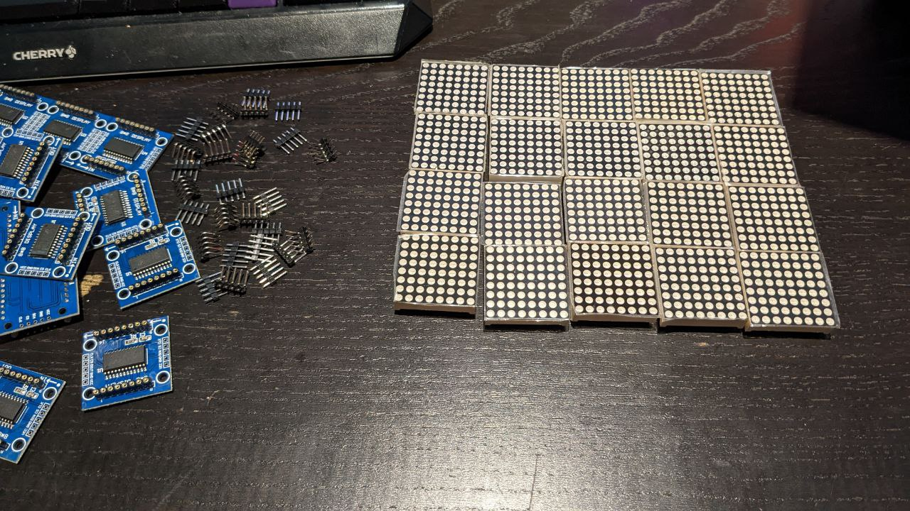
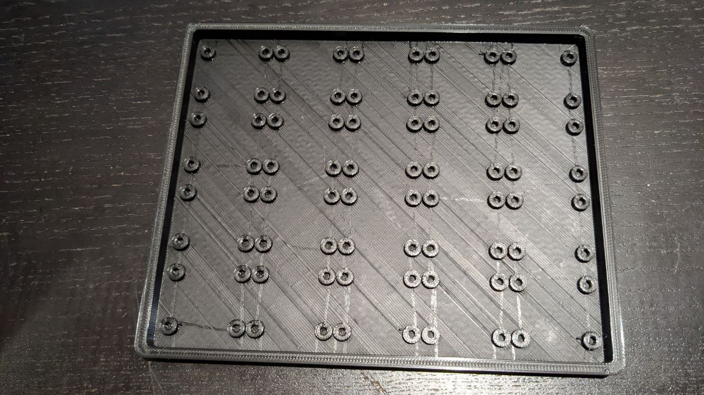
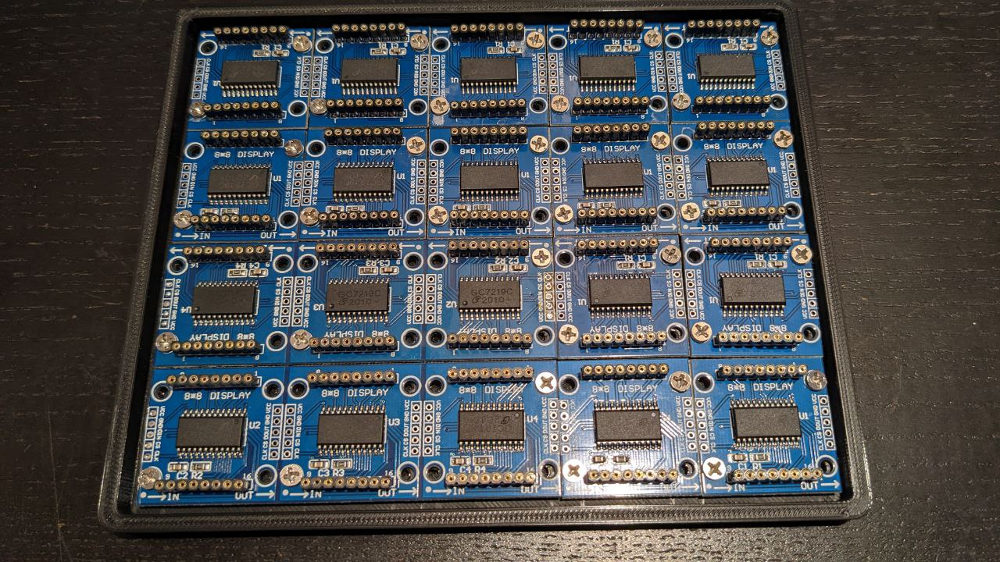
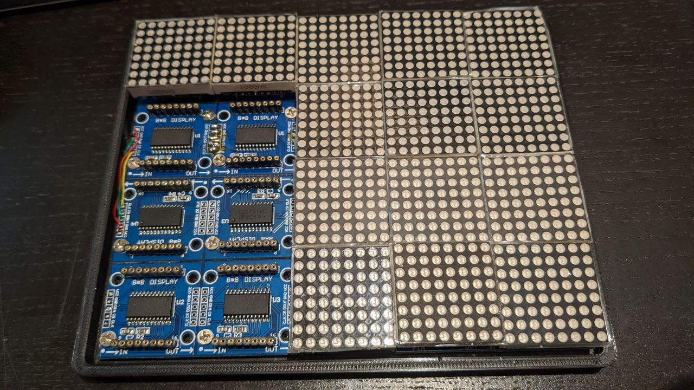
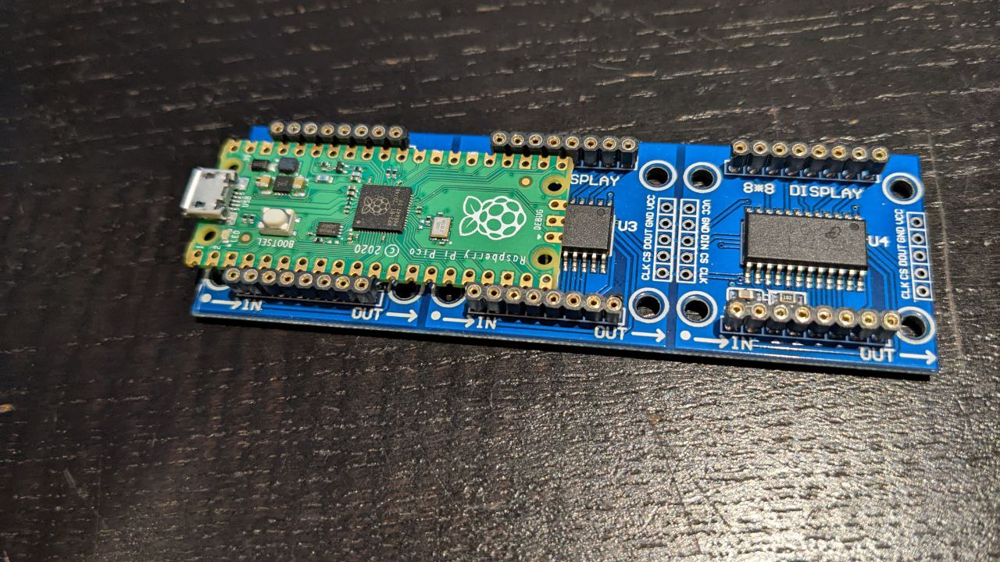
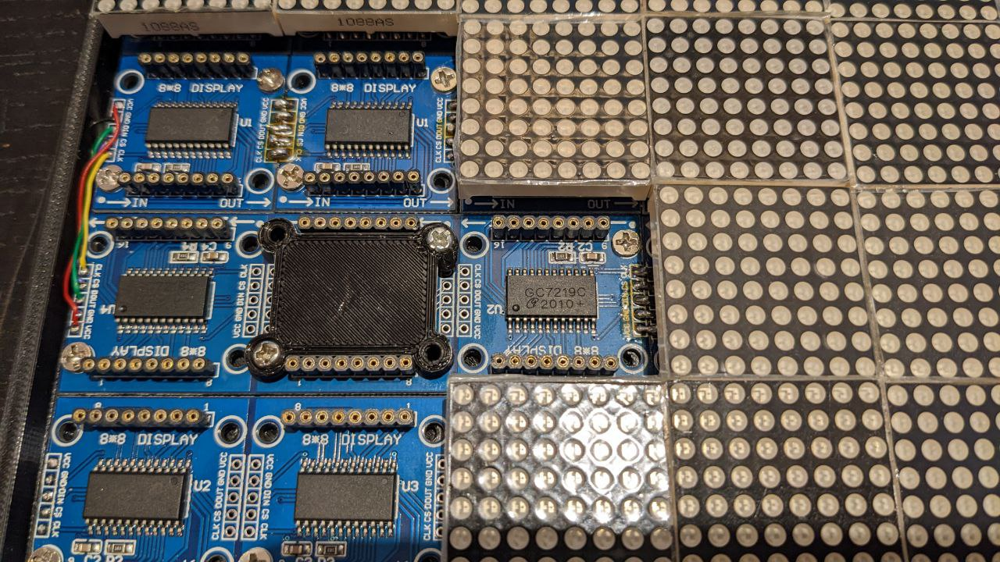
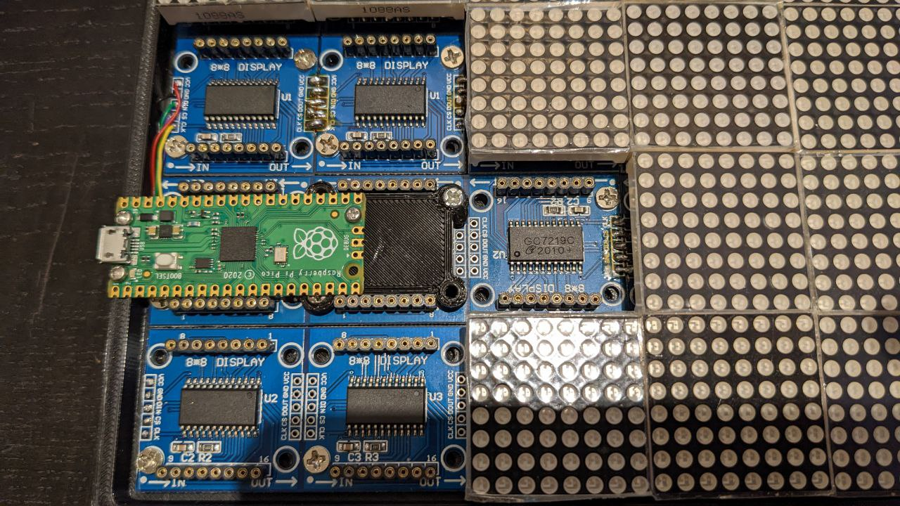
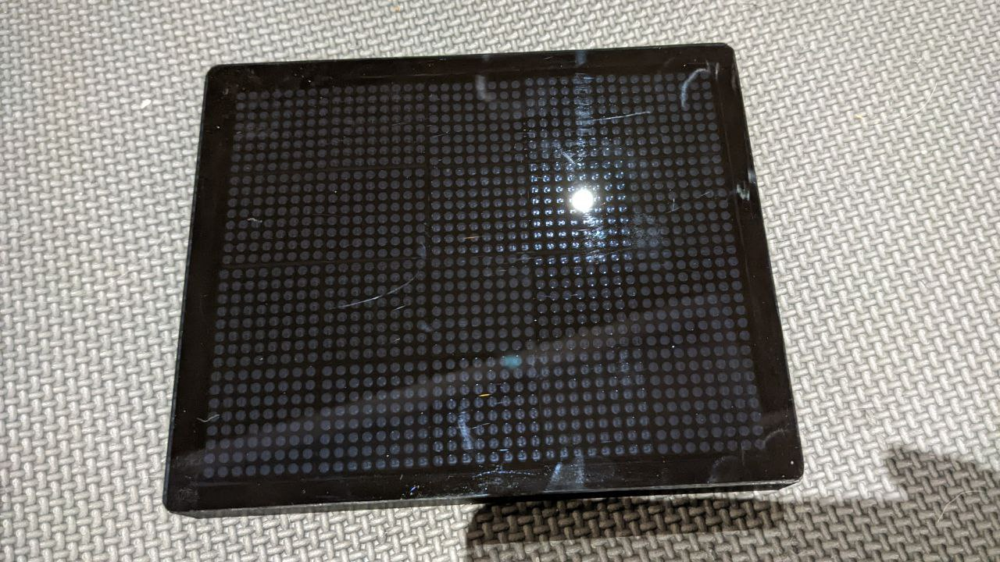

Hardware of the LED screen
==========================

The famous video [Bad Apple!!](https://youtu.be/FtutLA63Cp8) has an aspect ratio of 4:3.
It must be pixelized before playing on the LED screen.
In order to maximize the resolution, the LED screen should be as close to 4:3 as possible.

After some calculation, I decided to use 20 LED Matrix modules, each one with 8x8 LEDs.
This makes a screen with 40x32 LEDs, which is very close to 4:3.

A 3D printed frame is used to hold the LED Matrix modules together.

Assemble the LED Matrix modules together.

The input will start from the bottom left corner, then go right, then go up, then go left, then go up, and so on - just like a snake. This is to minimize the length of the wires.
I didn't use the headers provided by the LED Matrix modules. Instead, I soldered the wires directly to the modules. Adjaent modules are soldered together, and the last module in each row is connected to the first module in the next row with wires.

I also need to consider where to put the Raspberry Pi Pico. To minimize the size of the screen,
I decided to put the Raspberry Pi Pico in the space between the LED Matrix modules and their PCBs, like this:

A Raspberry Pi Pico without header fits perfectly in the space between the LED Matrix modules and their PCBs. To prevent short circuit, a 3D printed adapter is placed on the LED Matrix PCB. This piece is also used to hold the Raspberry Pi Pico in place.

Then put the Raspberry Pi Pico in place.

The last step is to solder the wires to the Raspberry Pi Pico. I forgot to take a photo of this step, but it's pretty straightforward.

- LED Matrix VCC => Pico VBUS (pin 40)
- LED Matrix GND => Pico GND (pin 3)
- LED Matrix CLK => Pico GP2 (pin 4)
- LED Matrix DIN => Pico GP3 (pin 5)
- LED Matrix CS => Pico GP5 (pin 7)

Finally, print a frame for the screen, and glue a piece of acrylic to the frame.

